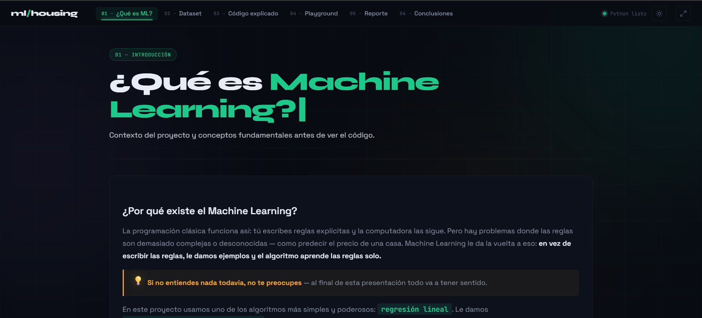
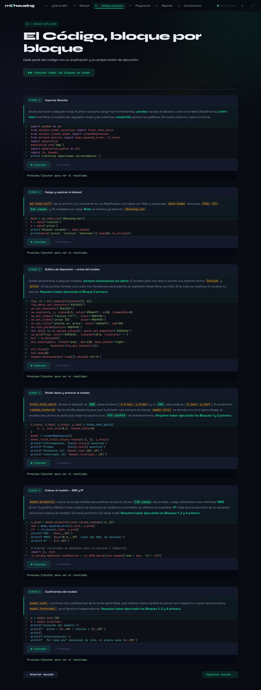
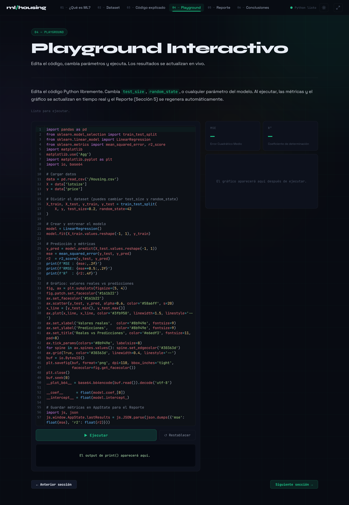
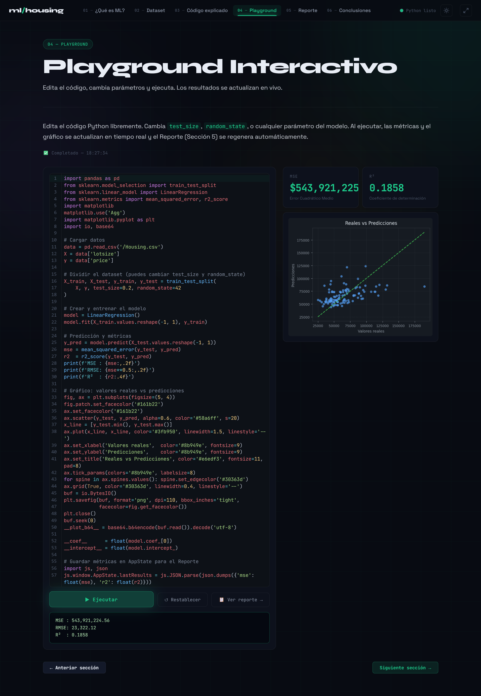

# 🤖 Machine Learning Interactive Project

<p align="center">
  
</p>

<p align="center">
  <a href="https://mlhousing520.vercel.app">
    
  </a>

  
  
  
  
  
  
  
</p>

<p align="center">
  🚀 Interactive Machine Learning Platform powered by Pyodide
</p>

---

# 🌐 Live Demo

👉 **Try the application here:**  
### 🔗 [Open mlhousing Web](https://mlhousing520.vercel.app)

---

# 📚 Description

This repository contains the final project for the course:

> **Programación de Modelos y Simulación**

The project focuses on explaining and implementing fundamental concepts of **Machine Learning**, including:

- Artificial Intelligence subfields
- AI historical evolution
- Datasets and ML libraries
- Linear Regression implementation
- Reports and conclusions

---

# 🚀 Project Evolution

The original academic presentation evolved into a fully interactive educational web platform.

The application allows users to:

✅ Explore Machine Learning concepts  
✅ Edit Python code directly in the browser  
✅ Execute code in real time using Pyodide  
✅ Learn interactively through practical examples  
✅ Visualize organized educational content  

---

# 🖥️ Application Preview

## 🎯 Main Interface





---

## 💻 Code Expleined Block by Block





---
## 💻 Interactive Code Editor





---

## ⚡ Python Runtime in Browser





---

# ✨ Main Features

- 🧠 Python execution directly in the browser
- 💻 Interactive code editor
- ⚡ Real-time runtime using Pyodide
- 📖 Educational Machine Learning content
- 🎨 Modern UI design
- 📂 Modular project organization
- 📊 Practical ML examples
- 🌐 Online deployment with Vercel

---

# 🛠️ Technologies Used

## 🔹 Machine Learning

- Python
- NumPy
- Pandas
- Matplotlib
- Scikit-learn
- Jupyter Notebook

## 🔹 Web Development

- HTML5
- CSS3
- JavaScript
- Pyodide
- Monaco Editor
- Git & GitHub
- Vercel

---

# 📁 Project Structure

```txt
machine-learning-presentacion/
│
├── 01-subcampos-ia/
├── 02-linea-tiempo/
├── 03-datasets-librerias/
├── 04-regresion-lineal/
│
├── 05-reportes-conclusiones/
│   ├── MyHousingApp/
│   │   ├── img/
│   │   ├── index.html
│   │   ├── main.js
│   │   ├── style.css
│   │   └── index.html.backup
│   │
│   ├── README.md
│   └── design.md
│
├── .gitignore
└── README.md
```

---

# ⚙️ Local Installation

## 1️⃣ Clone the repository

```bash
git clone https://github.com/abdair-coca/machine-learning-presentacion.git
```

---

## 2️⃣ Navigate into the project

```bash
cd machine-learning-presentacion
```

---

## 3️⃣ Run the web application

```bash
cd 05-reportes-conclusiones/MyHousingApp
```

Start a local server:

```bash
python -m http.server 5500
```

Open in browser:

```txt
http://localhost:5500
```

---

# 📖 Core Libraries

## NumPy

Used for numerical operations and array manipulation.

---

## Pandas

Used for data analysis and manipulation.

---

## Matplotlib

Used for data visualization and plotting.

---

## Scikit-learn

Used for building Machine Learning models.

---

## Pyodide

Allows Python execution directly inside the browser using WebAssembly.

---

# 🎯 Achievements

- ✅ Learned Machine Learning fundamentals
- ✅ Implemented ML models with Python
- ✅ Applied collaborative GitHub workflows
- ✅ Organized code professionally
- ✅ Built an educational web platform
- ✅ Integrated Python runtime into the browser
- ✅ Improved educational interaction through live coding

---

# 👥 Team Members

| Member | Responsibility |
|---|---|
| Roberto Copa | AI Subfields |
| Juan Canaza & Rodrigo Oquendo | Timeline |
| Carlos Matos | Datasets & Libraries |
| Moises Torrez | Linear Regression |
| Abdair Coca | Reports, conclusions, project integration and interactive web platform development |

---

# 🌟 Interactive Platform Development

The interactive web application was designed and implemented by **Abdair Coca** as part of the reports and conclusions section of the project.

The goal was to transform a traditional presentation into an interactive educational experience where users can:

- visualize concepts
- modify code
- execute examples
- experiment directly in the browser

---

# 📌 Best Practices Applied

- 📂 Modular architecture
- 🧹 Clean and maintainable code
- 🏷️ Descriptive naming conventions
- 🌿 Git branching workflow
- 📄 Clear documentation
- ♻️ Separation of responsibilities
- 🚀 Interactive-first educational design

---

# 📈 Future Improvements

- 🔥 More Machine Learning models
- 📊 Interactive charts
- 💾 Code persistence
- 📁 Custom dataset upload
- 🧠 Deep Learning integration

---

# 📌 Project Status

🟢 Completed  
🟢 Fully functional web platform  
🟢 Pyodide integration finished  
🟢 Deployed on Vercel  
🟢 Documentation completed  

---

# ⭐ Support

If you liked this project, consider giving it a star ⭐

---